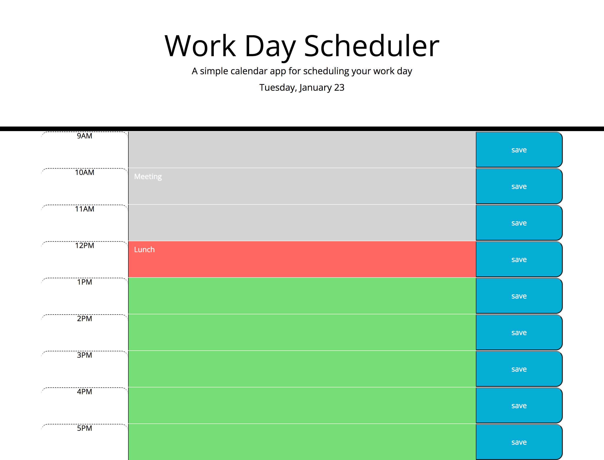

# Work-day-planner

# Description
This project was created using starter HTML and CSS code along with Javascript code that I created using jQuery and day.js. The aim of this project was to create a work day scheduler that enabled the user to save events under the correct business hour. Day.js was used to display the current date and to enable the textareas to be color coded based on the time the user looks at the webpage. For the current time they are looking at the webpage the textarea will display red in color. Any time before that will be grey and any time after that will be green. JQuery was used to create elements in the javascript file that would add to the HTML file. It was also used to add classes and ids and remove classes from elements in the HTML file. 

# Installation
N/A

# Usage
When the webpage is loaded the title and the current days date will be displayed at the top of the page. Below that, there are 9 rows each containing a business hour, a textarea to input data and a save button. When data is entered into the textarea and the save button is clicked, the data will be stored in the local storage. When the page is refreshed data from the local storage will be retrieved and displayed on the webpage.  

To access the webpage click this link: 

Below is a screenshot of the work day scheduler:

# Credits
Recieved support from a tutor to understand how to add an id to my row class in javascript so that the if statement would change the textarea color depending on the tense.

https://day.js.org/docs/en/display/format

https://api.jquery.com/append/

https://github.com/EdenKhaos/05-work-day-scheduler/blob/master/script.js : This supported me on how to retrieve the data from local storage.

# License
MIT